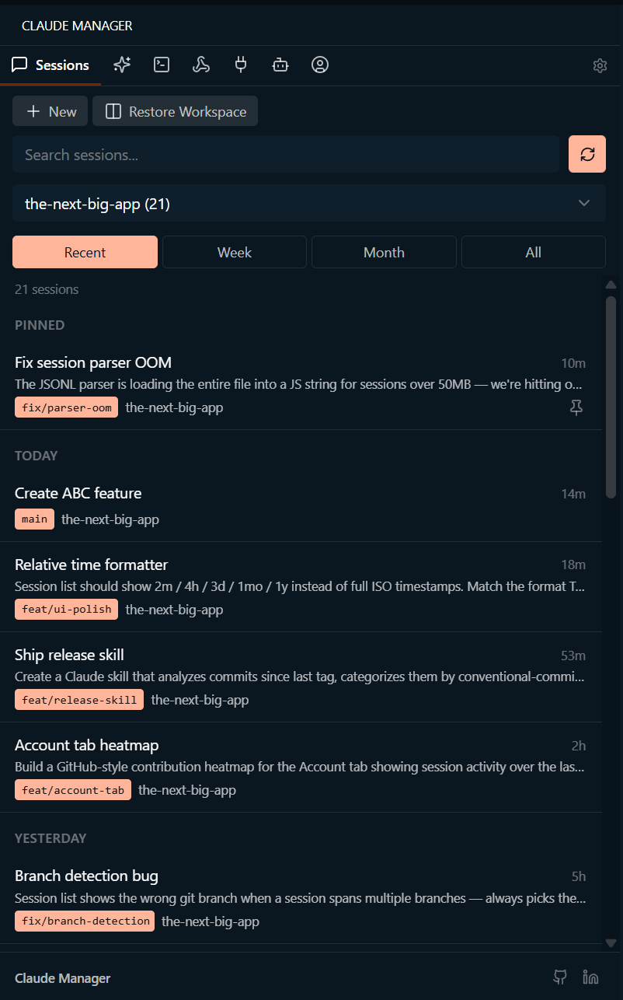
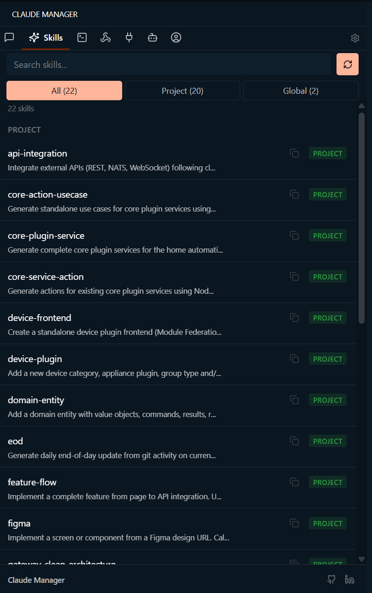
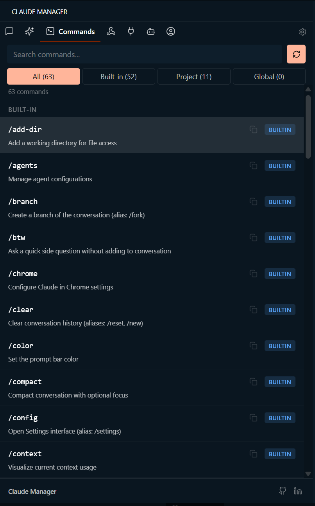
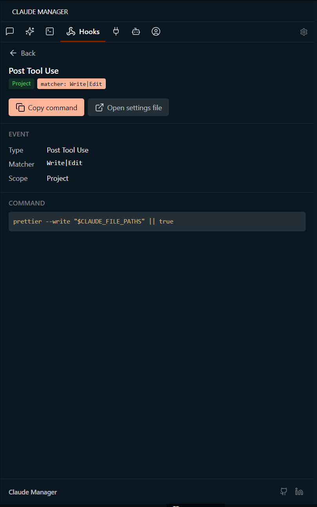
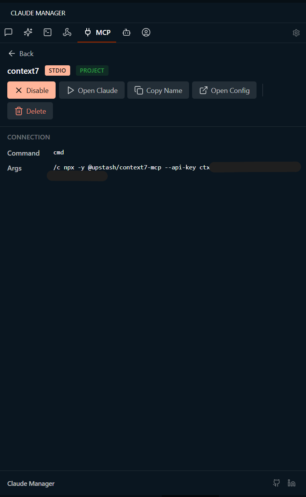
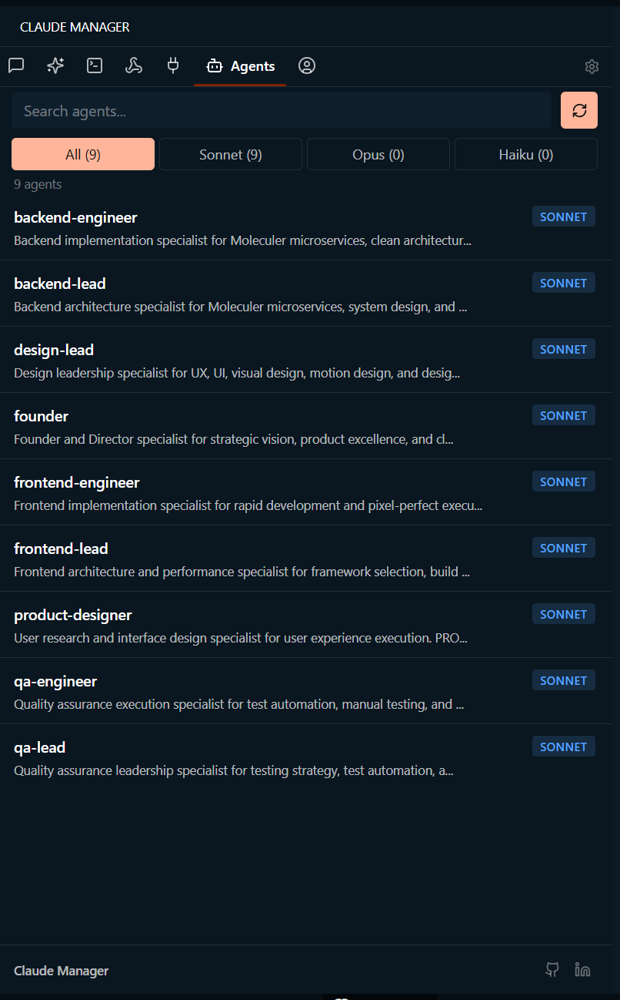
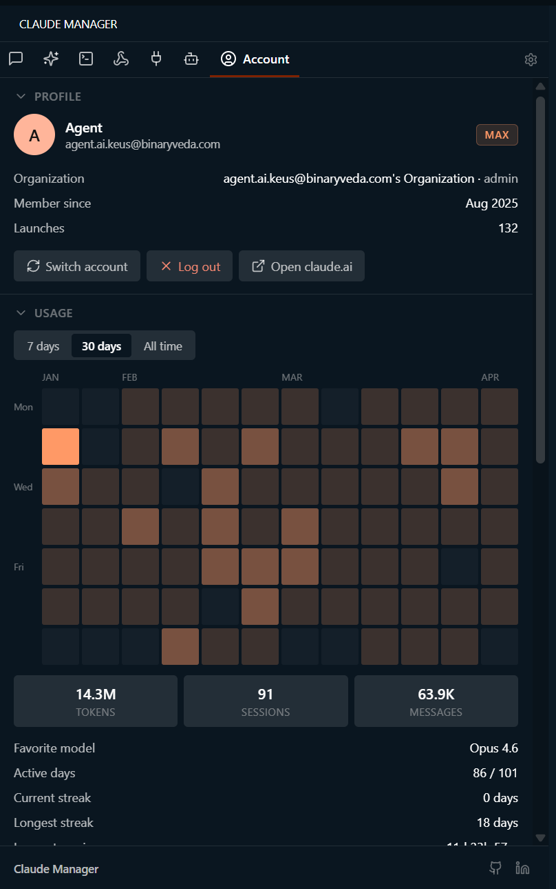

<h1>Claude Manager</h1>

<strong><a href="https://claude.ai/code">Claude Code</a>, one click closer &mdash; every session, skill, command, hook, MCP server, and agent in your VS Code sidebar.</strong>

 

100% local &bull; Zero telemetry &bull; Zero accounts &bull; Works in VS Code, Cursor, Windsurf, VSCodium, Codespaces, and Gitpod

 

## Install

**VS Code &bull; Cursor &bull; Windsurf** &mdash; open Extensions (<kbd>Ctrl</kbd>+<kbd>Shift</kbd>+<kbd>X</kbd>), search **Claude Manager**, click Install.

**VSCodium &bull; Theia &bull; Gitpod** &mdash; install from [Open VSX](https://open-vsx.org/extension/vishalguptax/claude-manager).

Then press <kbd>Ctrl</kbd>+<kbd>Alt</kbd>+<kbd>C</kbd> (<kbd>Cmd</kbd>+<kbd>Alt</kbd>+<kbd>C</kbd> on Mac) to open the panel. That's it.

 

## Why it exists

Claude Code is powerful, but the terminal isn't built for browsing. Finding a session you ran last week means scrollback hunting. Editing an MCP server means hand-patching JSON. Keeping track of every custom slash command, hook, and agent is its own job.

Claude Manager turns all of it into a sidebar you can click and search. Same Claude Code underneath &mdash; just one keystroke closer.

 

## What's inside

- **Sessions** &mdash; resume any Claude Code session in one click, with git branch detection
- **Skills** &mdash; browse global and project skills, copy, open, or launch Claude with one
- **Commands** &mdash; 52 built-in slash commands plus your custom ones, one-click copy
- **Hooks** &mdash; inspect automation hooks across global, project, and local scopes
- **MCP Servers** &mdash; enable, disable, delete, or inspect &mdash; no JSON editing
- **Agents** &mdash; browse project agents with Sonnet / Opus / Haiku badges
- **Account** &mdash; profile, activity heatmap, token usage, permissions
- **Status bar** &mdash; open Claude Manager from anywhere in your editor

<table>
<tr>
<td width="50%" valign="top" align="center">
 
<strong>Skills</strong> 
Global and project skills with scope badges. Copy, open, delete, or launch Claude with a skill.
</td>
<td width="50%" valign="top" align="center">
 
<strong>Commands</strong> 
52 built-in slash commands plus your custom ones from <code>.claude/commands/</code>. One-click copy.
</td>
</tr>
<tr>
<td width="50%" valign="top" align="center">
 
<strong>Hooks</strong> 
Inspect automation hooks across global, project, and local scopes with full command preview.
</td>
<td width="50%" valign="top" align="center">
 
<strong>MCP Servers</strong> 
Enable/disable, delete, or inspect MCP servers. API keys and secrets masked automatically.
</td>
</tr>
<tr>
<td width="50%" valign="top" align="center">
 
<strong>Agents</strong> 
Browse project agents with Sonnet / Opus / Haiku badges and description previews.
</td>
<td width="50%" valign="top" align="center">
 
<strong>Account</strong> 
Profile, activity heatmap, token stats, and permissions &mdash; without leaving your editor.
</td>
</tr>
</table>

 

## Sessions, in depth

- **Smart grouping** &mdash; Today, This Week, This Month, Older
- **Relative timestamps** &mdash; `now`, `2m`, `4h`, `3d`, `1mo`, `1y`
- **Filter** by project, branch, or date range
- **Pin** favorites &bull; **Rename** sessions &bull; **Fork** for alternate explorations
- **Resume** with branch detection &mdash; warns if your current branch differs
- **Restore Workspace** &mdash; reopen every terminal from your last working session
- **Search** across names, projects, branches, and prompts
- **Right-click menu** &mdash; pin, rename, fork, copy command, export as Markdown, delete

 

## Privacy

**100% local.** Claude Manager reads from `~/.claude/` and renders in a VS Code webview. Zero network requests. Zero telemetry. Zero accounts. Your data never leaves your machine.

 

## Compatibility

Works on every VS Code-based editor: **VS Code** &bull; **Cursor** &bull; **Windsurf** &bull; **VSCodium** &bull; **Theia** &bull; **Codespaces** &bull; **Gitpod**

Requires VS Code 1.85+ and [Claude Code](https://claude.ai/code) installed.

 

## Configuration

Open Settings (<kbd>Ctrl</kbd>+<kbd>,</kbd>) and search **Claude Manager**. Available options:

- Terminal location (editor vs. panel) and editor position
- Default session filter and default project filter
- Restore Workspace time window

See [docs/DEVELOPMENT.md](docs/DEVELOPMENT.md) for the full reference.

 

## Contributing

Found a bug? [Open an issue](https://github.com/vishalguptax/claude-code-manager/issues/new). PRs welcome.

 

<a href="LICENSE">Apache 2.0</a> &copy; <a href="https://vishalg.in">Vishal Gupta</a>
 
<a href="https://vishalg.in">Portfolio</a> &bull; <a href="https://github.com/vishalguptax">GitHub</a> &bull; <a href="https://www.linkedin.com/in/vishalguptax">LinkedIn</a>

